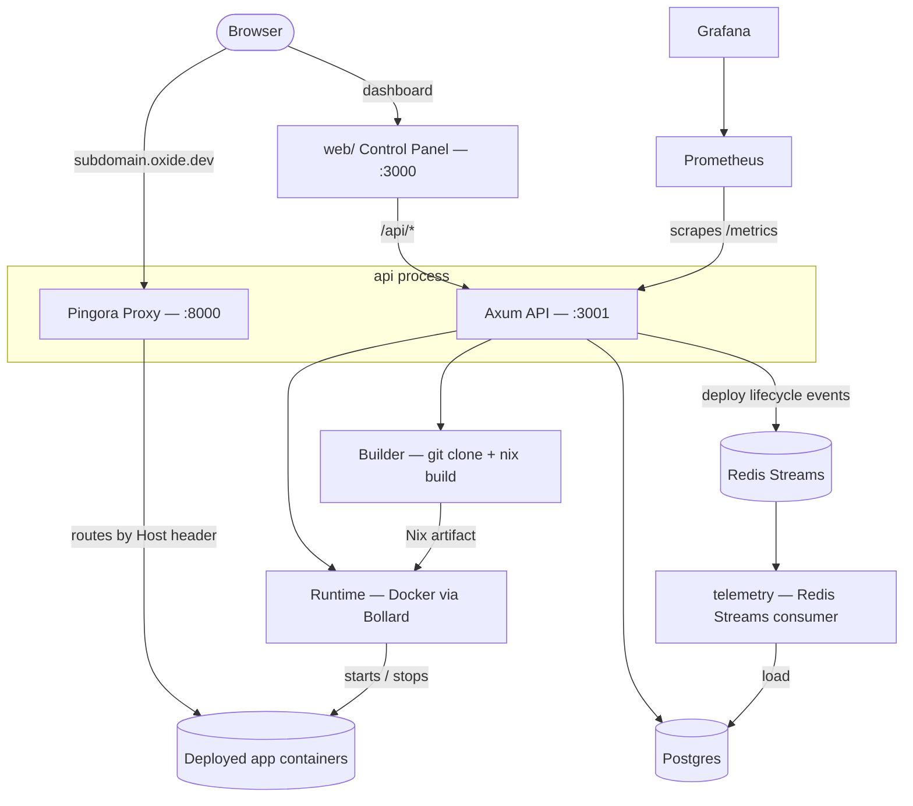

# Oxide

[](https://github.com/HrushikeshAnandSarangi/oxide/actions/workflows/ci.yml)

> Infrastructure as software — deterministic builds with Nix, isolated runtimes with Docker, proxied with Pingora.

Oxide is a self-hosted application deployment platform built entirely in Rust. It solves the version mismatch problem at the build layer using Nix for reproducible, deterministic builds, and isolates runtime concerns separately using Docker — two tools doing two distinct jobs rather than one tool doing both poorly. Pingora routes traffic, Axum serves the API, and Postgres/Redis/Prometheus/Grafana back the whole thing.

---

## The Problem Oxide Solves

Most deployment platforms conflate two separate concerns:

- **Build reproducibility** — will this build produce the same artifact on any machine, any time?
- **Runtime isolation** — will this process stay contained and not affect other running services?

Docker is often used for both. That works, but at the cost of large images, slow builds, and non-deterministic layer caching. Oxide separates these responsibilities explicitly — Nix owns the build, Docker owns the runtime. The tradeoff is a leaner, more predictable deployment pipeline where each tool does exactly one thing.

---

## Benchmarks, at a glance

Real, measured numbers — not aspirational ones. Full methodology, raw data, and how to reproduce every one of these yourself: **[benchmarks.md](benchmarks.md)**.

| | |
|---|---|
| **Container size** — Nix static build vs. the naive `FROM rust:1-bookworm` Dockerfile most projects actually ship | **814 kB vs 2.19 GB — ~2,690× smaller** |
| **Proxy routing latency** — `resolve_target`, the function Pingora calls per request | **flat ~270 ns from 1 to 10,000 registered routes** (~3.6–3.8M lookups/sec) |
| **Env var encryption** — AES-256-GCM, decrypted once per var on every deploy | **sub-2 µs**, even for a full connection-string-length secret |
| **`/metrics` scrape** — full Prometheus text-encode of the registry | **~10.5 µs** |

The Criterion numbers above are regenerated automatically on every GitHub Release and committed straight back to this repo by CI — see [.github/workflows/benchmarks.yml](.github/workflows/benchmarks.yml).

---

## Architecture



Nix builds the artifact deterministically; Docker isolates it at runtime. Pingora and the Axum API run in a single process (the proxy is spawned in-process — see [api/src/main.rs](api/src/main.rs)); the `telemetry` consumer and backing services run alongside it.

---

## Tech Stack

| Component | Technology | Reason |
|-----------|-----------|--------|
| API server | Axum (Rust) | Type-safe, async, minimal overhead |
| Proxy | Pingora (Rust) | Programmatic routing, Rust-native, handles its own graceful shutdown |
| Build system | Nix | Deterministic, reproducible artifacts |
| Runtime isolation | Docker | Process containment, resource limits |
| Control panel | Next.js | Sidebar dashboard — projects, live deploy status, logs |
| Metrics | Prometheus + Grafana | Live operational dashboards, scraped from `/metrics` |
| Telemetry ETL | Redis Streams + Postgres | Durable event log for historical deploy/build analytics |
| Benchmarks | Criterion.rs | Real measured numbers, auto-updated on release |

---

## Features

- **Deterministic builds via Nix** — identical artifacts across any host, version mismatch eliminated at build time
- **Docker runtime isolation** — each deployed app runs in its own container
- **Auto-generated Nix flakes** — opt-in per project: if a repo has a Dockerfile but no `flake.nix`, Oxide detects the language (Rust, Go, TypeScript, JavaScript, Python) and generates one at build time. Rust/Go/TS/JS builds are fully hermetic; Python's `pip install` trades reproducibility for practicality (network access during build — there's no nixpkgs-native equivalent of Go's vendored-hash pattern for arbitrary `requirements.txt`). See [builder/src/flake_gen.rs](builder/src/flake_gen.rs).
- **Subdomain-based routing via Pingora** — a `DashMap` of subdomain → port, O(1) regardless of how many apps are deployed (benchmarked above)
- **One-command rollback** — redeploys a project's previous artifact directly, no git clone or nix build, since it's already in the Nix store
- **Live build & deploy logs** — `nix build` and `docker build` output streams line-by-line into the deployment record as it happens, plus container runtime logs, viewable in the dashboard
- **Graceful deletion** — deleting a deployment stops and removes its container and cleans up its route rather than leaving orphaned state; deploys that never reach `Running` aren't kept around as clutter
- **Graceful shutdown, live-verified** — SIGTERM/Ctrl+C drain in-flight requests, stop background workers cleanly, and let Pingora finish its own connection drain, confirmed by sending real signals to running processes and reading the resulting logs, not just reading the code
- **Health monitoring** — periodic per-deployment checks, automatic route removal and status update on failure
- **Prometheus metrics + Grafana dashboards** — deploy counts by status, build duration, active containers, health-check failures; `docker compose up -d` brings up the whole observability stack locally
- **Telemetry ETL (Redis Streams)** — deployment lifecycle events stream through Redis into a Postgres event log via the `telemetry` consumer, independent of live metrics
- **Dashboard control panel** — project sidebar with live status, a unified create-and-deploy flow, a deployments table with rollback/logs/delete actions
- **CI/CD** — format check, clippy, build, and test on every push/PR; benchmarks re-run and commit fresh numbers on every GitHub Release
- **Tests** — unit coverage across routing, crypto, artifact resolution, and flake-template generation, plus a live end-to-end test that builds a generated flake with real Nix ([builder/tests/live_flake_gen.rs](builder/tests/live_flake_gen.rs))

---

## Getting Started

### Prerequisites

- Rust 1.85+ (edition 2024)
- Nix (with flakes enabled)
- Docker
- Node.js (for the dashboard and root orchestration)

**Install Nix:**
```bash
curl --proto '=https' --tlsv1.2 -sSf -L https://install.determinate.systems/nix | \
  sh -s -- install
```

Enable flakes in `~/.config/nix/nix.conf`:
```
experimental-features = nix-command flakes
```

### Clone and Build

```bash
git clone https://github.com/HrushikeshAnandSarangi/oxide
cd oxide
cargo build --release
```

### Run Locally

One-time setup (Postgres, Redis, Prometheus, Grafana via `docker compose`, migrations, build; requires the Docker daemon already running):

```bash
./scripts/dev_setup.sh
npm run setup
```

Then bring up the whole architecture — backing services, the `api` process (Axum API on `:3001` incl. `/metrics`, plus the Pingora proxy on `:8000`, spawned in-process), the `telemetry` ETL consumer, and the `web/` control panel (`:3000`), all at once:

```bash
npm run start
```

`web/` is Oxide's dashboard: create a project (with its Git repo URL), trigger a deploy, and watch deployment status and logs live — it proxies `/api/*` to the Rust API (see `web/next.config.ts`). Stop everything with `npm run stop` (stops the docker-compose services; `Ctrl+C` stops the Rust/Next processes).

Prefer running each piece by hand instead? `cargo run -p api`, `cargo run -p telemetry`, and `npm --prefix web run dev` individually, after `docker compose up -d`.

#### Port map

| Port | Service |
|---|---|
| 3000 | `web/` control panel (Next.js dev server) |
| 3001 | Oxide API (Axum) |
| 3002 | Grafana |
| 5432 | Postgres |
| 6379 | Redis |
| 8000 | Pingora proxy |
| 9090 | Prometheus |

### Run Tests

```bash
cargo test --workspace
```

### Benchmarks

```bash
cargo bench --workspace
```

See **[benchmarks.md](benchmarks.md)** for full measured results and methodology — proxy routing, crypto, metrics encoding, and the Nix-vs-naive-Docker container size comparison.

---
